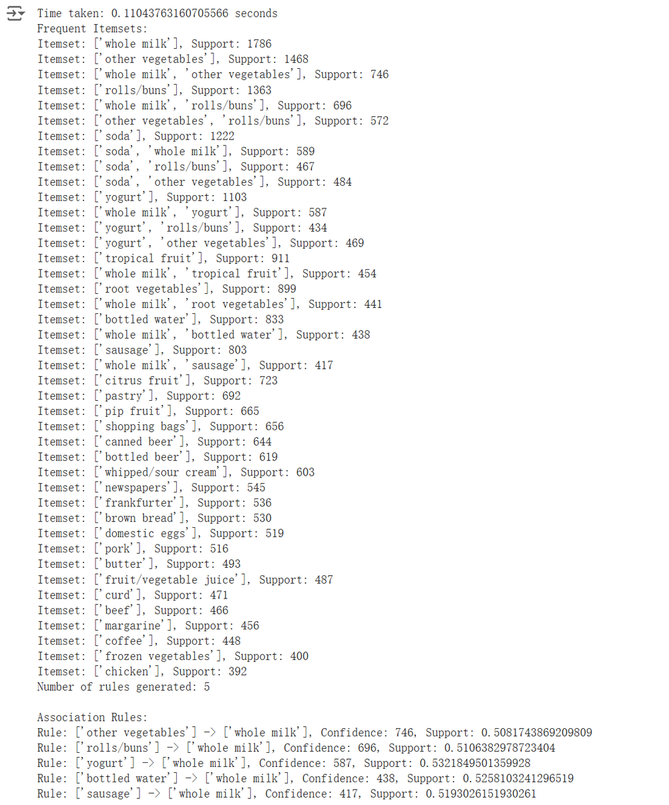

# Apriori-vs-BruteForce
Assignment-2 in IN6227: Comparation between Apriori &amp; BruteForce

## Introduction
In this report, the Orange Python library as association rule mining tool is applied to implement the Apriori algorithm. Additionally, a brute_force_association_rule_mining function is used to implement a brute-force algorithm and compared their runtimes.

Five datasets from Kaggle:
- [Market Basket Analysis (Dataset 1)](https://www.kaggle.com/datasets/aslanahmedov/market-basket-analysis)
- [Groceries dataset (Dataset 2)](https://www.kaggle.com/datasets/heeraldedhia/groceries-dataset)
- [E-commerce Business Transaction (Dataset 3)](https://www.kaggle.com/datasets/gabrielramos87/an-online-shop-business)
- [Transaction Data (Dataset 4)](https://www.kaggle.com/datasets/vipin20/transaction-data)
- [Sales transaction dataset of Google Merchandise Store (Dataset 5)](https://www.kaggle.com/datasets/dinosilooy/sales-transaction-of-an-online-retailer)

The results are presented in the following tables. Fig. 1 show the results for 200 items, while Fig. 2 show the results for 15 items. The minimum support and confidence values used were `[0.1, 0.5]` and `[0.4, 0.7]`, respectively.

## Running Results

### Scenario 1
| ItemCount = 200 | Dataset-1   | Dataset-2   | Dataset-3   | Dataset-4   | Dataset-5   |
|-----------------|-------------|-------------|-------------|-------------|-------------|
| **Apriori `(min_support = 0.1, min_confidence = 0.5)`** | 0.0172 s    | 0.1104 s    | 0.3313 s    | 0.0169 s    | 0.0182 s    |
| **Apriori `(min_support = 0.4, min_confidence = 0.7)`** | 0.0154 s    | 0.0151 s    | 0.0137 s    | 0.0192 s    | 0.1531 s    |
| **Brute-force `(min_support = 0.1, min_confidence = 0.5)`** | NA (6 min+) | NA (45 min+) | NA          | NA          | NA          |
| **Brute-force `(min_support = 0.4, min_confidence = 0.7)`** | NA (6 min+) | NA (5.5 h+)  | NA          | NA          | NA          |

Explanation of N/A: The brute-force algorithm examines every possible combination of items, so the time required grows exponentially as the item count increases. With an item count of 200, the computation becomes too large to complete within the limits of available computing resources, making the exact runtime unknown (N/A).

The plot is as follow:

### Scenario 2

| ItemCount = 15  | Dataset-1   | Dataset-2   | Dataset-3   | Dataset-4   | Dataset-5   |
|-----------------|-------------|-------------|-------------|-------------|-------------|
| **Apriori `(min_support = 0.1, min_confidence = 0.5)`** | 0.0099 s    | 0.0061 s    | 0.0295 s    | 0.0097 s    | 0.2870 s    |
| **Apriori `(min_support = 0.4, min_confidence = 0.7)`** | 0.2163 s    | 0.0143 s    | 0.0272 s    | 0.2491 s    | 0.0091 s    |
| **Brute-force `(min_support = 0.1, min_confidence = 0.5)`** | 283.2342 s | 57.1152 s   | 328.6313 s | 322.9166 s | 320.3835 s |
| **Brute-force `(min_support = 0.4, min_confidence = 0.7)`** | 277.4457 s | 57.3230 s   | 322.9803 s | 322.9933 s | 325.1465 s |

## Mining Result Sample

And one of the mining results of Dataset 2 when `min_support = 0.1` and `min_confidence = 0.5`.

